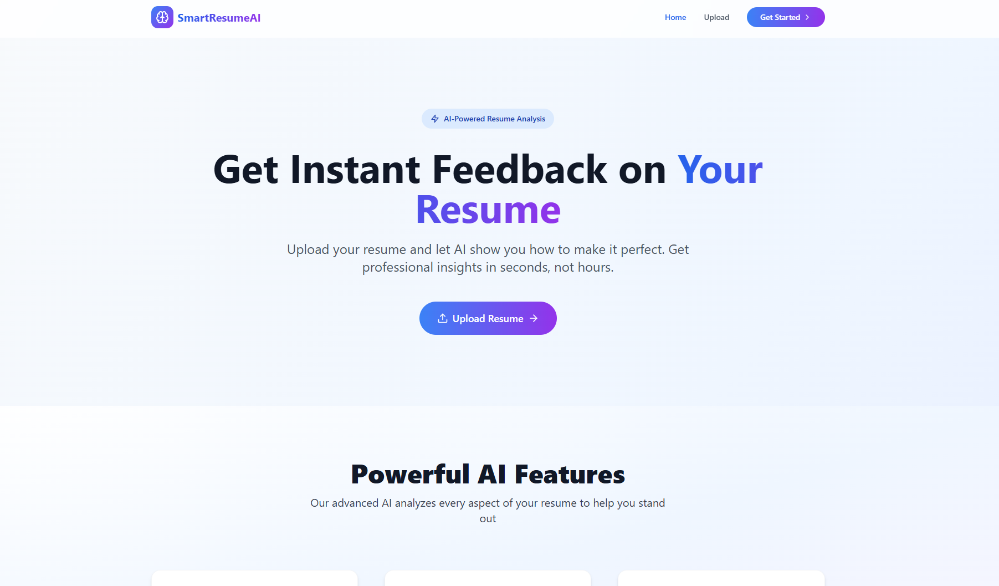
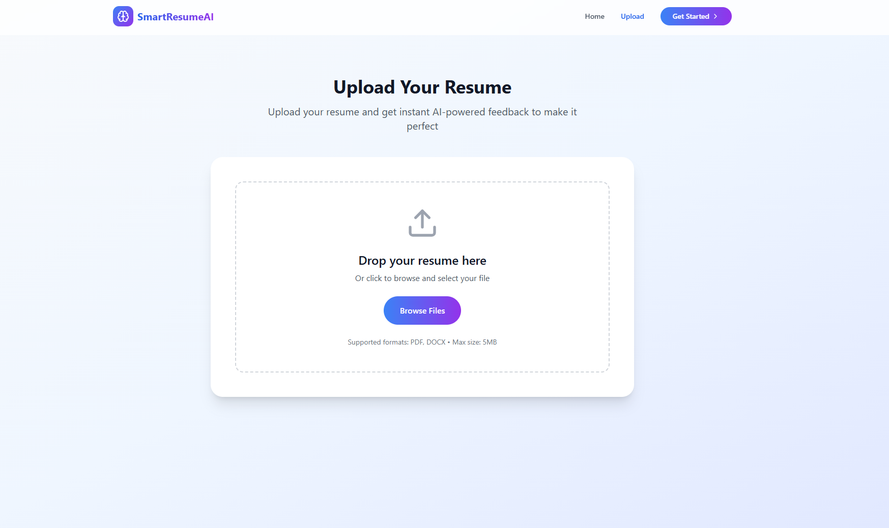
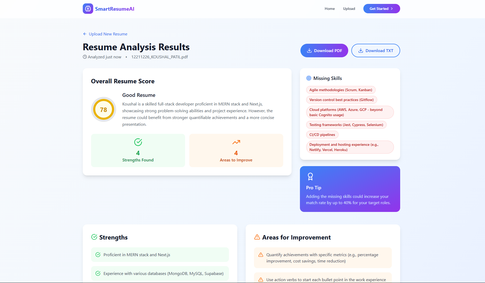

# 📄 ResumeParser-MemoryStorage

## This repository implements an **in-memory file processing approach** using `multer.memoryStorage()`.

## 🔧 Approach:

### 1. File Upload

- Files are uploaded via frontend using `multipart/form-data`.
– On the backend, multer is configured with memoryStorage instead of diskStorage. Alternatively, multer can also be integrated with cloud storage providers (like Cloudinary, AWS S3) to store files directly.

### 2. In-Memory Buffer Handling

- Uploaded files are **not saved to disk**.
- Instead, the file is available as a buffer (`req.file.buffer`) directly in memory.

### 3. PDF Parsing

- This buffer is passed directly to the `pdf-parse` library for text extraction.

### 4. LLM Analysis

- The extracted text is then sent to an LLM (Large Language Model) for intelligent feedback and suggestions.

## ⚡ Why This Is Better (Compared to Disk-Based Approach):

- **Faster**: Avoids slow disk I/O operations. Processing in RAM is significantly quicker.
- **Scalable**: Suitable for cloud deployments where ephemeral storage is preferred or disk write limits exist.
- **Secure**: No temporary files written to disk, reducing risk of leftover sensitive data.
- **Lightweight**: Reduces server load and improves performance under high traffic.

---

This makes the application more **efficient, scalable, and production-ready**, especially in **serverless or container-based environments**.

## 🖼️ Demo

---

## 🛠️ Tech Stack

**Frontend:**

- React.js / Next.js
- Tailwind CSS or Bootstrap
- Axios for API integration

**Backend:**

- Node.js with Express.js
- Multer for file uploads
- PDF-Parse / Mammoth for text extraction
- Integration with Gemini API / OpenAI / Google PaLM (any free LLM)

**Others:**

- dotenv for environment config
- fs, path modules
- CORS & error-handling middleware

---

## 🧠 How it Works

1. **Upload Resume**  
   Users upload their resume in `.pdf` or `.docx` format.

2. **Text Extraction**  
   The backend extracts text content using `pdf-parse` or `mammoth`.

3. **AI Analysis**  
   The extracted text is sent to an LLM (like Gemini or OpenAI) which returns a structured analysis.

4. **Display Results**  
   The frontend displays the feedback in a clean, readable format with sections like:
   - 📌 Highlights
   - ❗ Suggestions
   - 🚀 Opportunities to Improve

---

## 💡 Use Cases

- Job seekers wanting to optimize their resume
- Resume review tools for placement cells
- HR & Recruitment automation
- Resume parsing for applicant tracking systems

---
